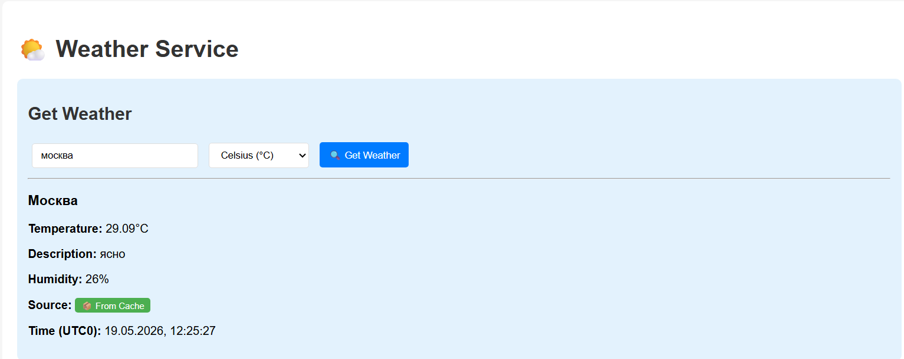
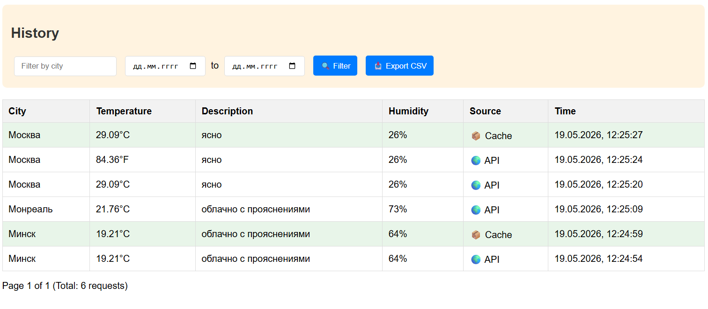

# Weather Service

[](https://www.python.org/)
[](https://fastapi.tiangolo.com/)
[](https://www.postgresql.org/)
[](https://redis.io/)
[](https://www.docker.com/)
[](https://pytest-cov.readthedocs.io/)
[](https://github.com/psf/black)

## Оглавление

- [О проекте](#о-проекте)
- [Ключевые возможности](#ключевые-возможности)
- [Технологический стек](#технологический-стек)
- [Быстрый старт](#быстрый-старт)
- [Веб-интерфейс](#веб-интерфейс)
- [API Endpoints](#api-endpoints)
- [Примеры ответов API](#примеры-ответов-api)
- [Архитектура проекта](#архитектура-проекта)
- [Тестирование](#тестирование)
- [Метрики производительности](#метрики-производительности)
- [Переменные окружения](#переменные-окружения)
- [Docker команды](#docker-команды)
- [Разработка](#разработка)
- [Лицензия и авторство](#лицензия-и-авторство)

---

## О проекте

Сервис для получения актуальной информации о погоде с кэшированием, историей запросов и экспортом данных.

## Ключевые возможности

- **Получение погоды** — интеграция с OpenWeatherMap API
- **Умное кэширование** — повторные запросы в течение 5 минут возвращают кэшированные данные с флагом `is_cached`
- **История запросов** — пагинация, фильтрация по городу и диапазону дат
- **Экспорт данных** — выгрузка истории в CSV
- **Rate Limiting** — ограничение 30 запросов в минуту на IP (HTTP 429 при превышении)
- **Health Check** — мониторинг состояния БД и внешнего API
- **Структурированное логирование** — логи в формате key=value с замерами времени

## Технологический стек

| Компонент | Технология |
|-----------|------------|
| Язык | Python 3.11 |
| Фреймворк | FastAPI |
| ORM | SQLAlchemy 2.0 |
| Миграции | Alembic |
| База данных | PostgreSQL 15 |
| Кэш | Redis 7 |
| HTTP клиент | httpx (async) |
| Лимитирование | slowapi |
| Тестирование | pytest + fakeredis |
| Контейнеризация | Docker Compose |

---

## Быстрый старт

### Требования

- Docker Desktop 20.10+
- Docker Compose 2.0+

### Установка и запуск

```bash

# 1. Клонировать репозиторий
git clone https://github.com/svirilinmax/weather_service.git
cd weather_service

# 2. Создать .env файл из примера
cp .env.sample .env

# 3. Добавить API ключ OpenWeatherMap в .env
# WEATHER_API_KEY=your_api_key_here

# 4. Запустить все сервисы
docker-compose up --build

# 5. Проверить работу
curl http://localhost:8000/api/v1/health
```

После запуска сервис доступен:
- API документация: http://localhost:8000/docs
- Web интерфейс: http://localhost:8000/weather

### Запуск тестов

```bash

# Все тесты с покрытием
docker-compose exec web pytest tests/ -v --cov=app

# Только тесты (без покрытия)
docker-compose exec web pytest tests/ -v

# Конкретный тестовый файл
docker-compose exec web pytest tests/test_weather.py -v
```

---

## Веб-интерфейс

### Получение погоды

Страница позволяет ввести название города, выбрать единицы измерения (Celsius/Fahrenheit) и получить текущую погоду. При повторном запросе в течение 5 минут отображается индикатор "From Cache".



### История запросов

Таблица с историей всех запросов поддерживает:
- Фильтрацию по городу (подстрока)
- Фильтрацию по диапазону дат
- Пагинацию (10 записей на страницу)
- Экспорт отфильтрованных данных в CSV



---

## API Endpoints

### 1. Получение погоды

```http
GET /api/v1/weather?city={city}&units={celsius|fahrenheit}
```

**Параметры:**

| Параметр | Тип | Обязательный | Описание |
|----------|-----|--------------|----------|
| city | string | Да | Название города |
| units | enum | Нет | celsius (default) или fahrenheit |

### 2. История запросов

```http
GET /api/v1/weather/history?city={city}&date_from={date}&date_to={date}&page={page}&size={size}
```

**Параметры:**

| Параметр | Тип | Описание |
|----------|-----|----------|
| city | string | Фильтр по городу (подстрока, регистронезависимый) |
| date_from | date | Начало диапазона (ISO 8601) |
| date_to | date | Конец диапазона (ISO 8601) |
| page | int | Номер страницы (default: 1) |
| size | int | Размер страницы (default: 10, max: 100) |

### 3. Экспорт истории в CSV

```http
GET /api/v1/weather/export?city={city}&date_from={date}&date_to={date}
```

**Ответ:** CSV файл с заголовками:
`ID,Город,Температура,Описание,Влажность,Ед.Изм.,Из Кэша,Дата Запроса (UTC)`

### 4. Health Check

```http
GET /api/v1/health
```

**Возможные статусы:**

| Статус | Код | Описание |
|--------|-----|----------|
| healthy | 200 | БД и внешний API работают |
| degraded | 200 | БД работает, внешний API недоступен |
| unhealthy | 503 | БД недоступна |

### 5. Корневой эндпоинт

```http
GET /
```

**Ответ:** Информация о сервисе и ссылка на документацию.

---

## Примеры ответов API

### Health Check

```http
GET /api/v1/health
```

```json
{
  "status": "healthy",
  "database": "connected",
  "database_duration_ms": 16.56,
  "external_api": "reachable",
  "external_api_duration_ms": 646.17,
  "total_duration_ms": 666.03
}
```

### Получение погоды

```http
GET /api/v1/weather?city=минск&units=celsius
```

```json
{
  "city": "Минск",
  "temperature": 19.29,
  "description": "ясно",
  "humidity": 66,
  "units": "C",
  "is_cached": false,
  "timestamp": "2026-05-19T13:03:08.938298"
}
```

### История запросов

```http
GET /api/v1/weather/history?city=Минск
```

```json
{
  "total": 2,
  "page": 1,
  "size": 10,
  "items": [
    {
      "id": 2,
      "city": "Минск",
      "temperature": 19.21,
      "description": "облачно с прояснениями",
      "humidity": 64,
      "units": "C",
      "is_cached": true,
      "timestamp": "2026-05-19T12:24:59.192418"
    },
    {
      "id": 1,
      "city": "Минск",
      "temperature": 19.21,
      "description": "облачно с прояснениями",
      "humidity": 64,
      "units": "C",
      "is_cached": false,
      "timestamp": "2026-05-19T12:24:54.930675"
    }
  ]
}
```

### Корневой эндпоинт

```http
GET /
```

```json
{
  "message": "Weather Service API приветствует тебя! Перейди на /docs для Swagger UI."
}
```

---

## Архитектура проекта

```
weather_service/
├── app/
│   ├── api/v1/              # API эндпоинты
│   │   ├── health.py        # Health check
│   │   └── weather.py       # Погода, история, экспорт
│   ├── core/                # Ядро приложения
│   │   └── limiter.py       # Rate limiter (shared)
│   ├── docs/                # Скриншоты для README
│   │   ├── get_weather.png
│   │   └── history.png
│   ├── middlewares/         # Middleware
│   │   └── logging_middleware.py
│   ├── models/              # SQLAlchemy модели
│   │   └── weather.py
│   ├── schemas/             # Pydantic схемы
│   │   ├── enums.py         # TemperatureUnit
│   │   └── weather.py
│   ├── services/            # Бизнес-логика
│   │   └── weather_api.py   # OpenWeatherMap клиент
│   ├── templates/           # HTML шаблоны
│   │   └── index.html       # Web интерфейс
│   ├── config.py            # Pydantic Settings
│   ├── database.py          # DB session
│   └── main.py              # FastAPI приложение
├── migrations/              # Alembic миграции
├── tests/                   # Тесты (16 тестов, 91% coverage)
├── docker-compose.yml
├── Dockerfile
├── requirements.txt
└── .env.sample
```

---

## Тестирование

### Покрытие кода

| Компонент | Покрытие |
|-----------|----------|
| app/services/weather_api.py | 100% |
| app/schemas/ | 100% |
| app/models/ | 100% |
| app/config.py | 100% |
| app/api/v1/weather.py | 84% |
| app/api/v1/health.py | 88% |
| **Общее** | **91%** |

### Список тестов

```bash

tests/test_health.py           # 2 теста
tests/test_history.py          # 4 теста
tests/test_rate_limiter.py     # 1 тест
tests/test_weather.py          # 3 теста
tests/test_weather_api.py      # 4 теста
tests/test_database.py         # 1 тест
tests/test_logging_middleware.py # 1 тест
━━━━━━━━━━━━━━━━━━━━━━━━━━━━━━━━━━━━━━━━━
Total: 16 passed, 0 failed
```

---

## Метрики производительности

| Операция | Время (среднее) |
|----------|-------------|
| Health check (БД + API) | ~500ms      |
| Запрос погоды (первый) | ~400-600ms  |
| Запрос погоды (кэш) | ~25ms       |
| История (10 записей) | ~15ms       |
| Экспорт CSV (100 записей) | ~30ms       |

---

## Переменные окружения

```bash

# PostgreSQL
POSTGRES_USER=postgres
POSTGRES_PASSWORD=your_password
POSTGRES_HOST=db                    # db для Docker, localhost для локального запуска
POSTGRES_PORT=5432
POSTGRES_DB=weather_db

# Redis
REDIS_URL=redis://weather_redis:6379/0

# OpenWeatherMap
WEATHER_API_KEY=your_api_key_here
WEATHER_API_URL=https://api.openweathermap.org/data/2.5/weather

# Rate Limiting
RATE_LIMIT_PER_MINUTE=30

# Cache
WEATHER_CACHE_TTL_SECONDS=300

# FastAPI
DEBUG=True
PROJECT_NAME="Weather Service API"
```

---

## Docker команды

```bash

# Сборка и запуск
docker-compose up --build

# Запуск в фоне
docker-compose up -d

# Остановка с удалением томов
docker-compose down -v

# Просмотр логов
docker-compose logs -f web

# Выполнение миграций
docker-compose exec web alembic upgrade head

# Создание новой миграции
docker-compose exec web alembic revision --autogenerate -m "description"

# Запуск тестов
docker-compose exec web pytest tests/ -v --cov=app
```

---

## Разработка

### Установка pre-commit хуков

```bash

pip install pre-commit
pre-commit install
```

### Форматирование кода

```bash

# Black форматирование
black app/ tests/

# Сортировка импортов
isort app/ tests/

# Линтинг
flake8 app/ tests/
```

---

## Лицензия и авторство

| | |
|---|---|
| **Лицензия** | MIT |
| **Разработчик** | Максим Свирилин |
| **Репозиторий** | [https://github.com/svirilinmax/weather_service.git](https://github.com/svirilinmax/weather_service) |
| **Email** | [svirilin.work@mail.ru](mailto:svirilin.work@mail.ru) |
| **Telegram** | [@svirilinmax](https://t.me/svirilinmax) |
```
